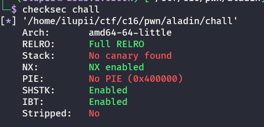
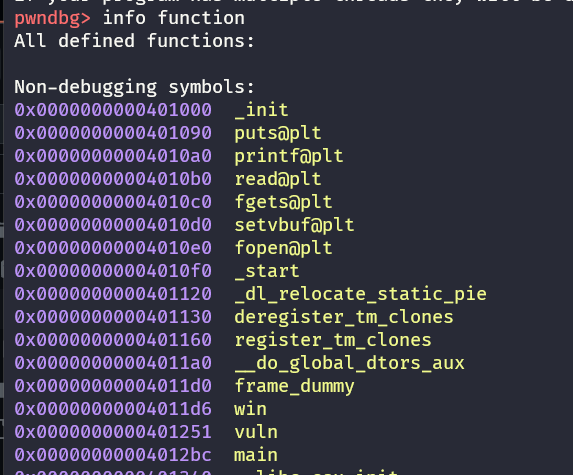
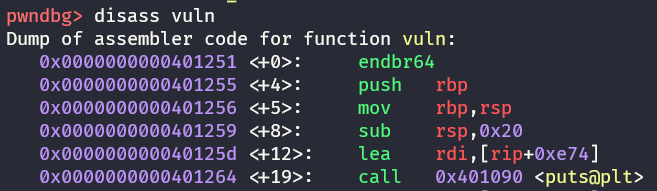
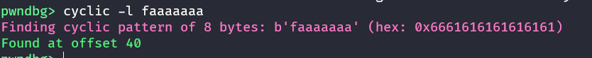

# aladin
### Category: Binary Exploitation

**Deskripsi:**
>terkadang sebuah perjuangan tidak hanya memerlukan usaha, tapi memerlukan bantuan dari dunia gaib, hehehe...
>
>Author: nabilmuafa

## Analisis
Pada Chall ini kita di berikan sebuah file binary, dikarenakan ini chall pwn/binary exploitation maka hal yang pertama kita lakukan yaitu 
melakukan checksec, untuk mengecek keamanan dari file tersebut



Disebutkan di sini no canary found yang artinya tidak ada byte random sebelum saved rbp, dan no pie yang artinya tidak ada pengacakan address
di dalam binary dan file nya 64 bit, maka dari itu kita bisa dengan mudah mengoverflow file ini.

langkah selanjutnya kita analisis file nya menggunakan gdb seperti ini



di lihat dari function yang ada, maka kita bisa simpulkan ini adalah chall ret2win
[link ini](https://book.hacktricks.xyz/binary-exploitation/stack-overflow/ret2win)

kita coba analisis fungsi vuln nya



set rsp nya 0x20 atau 32 + save rbp 8 byte = 40, kita bisa menimpa buffer untuk menuju return address dan mengubah return tersebut menjadi return ke win.
kalau masih kurang yakin kita bisa menggunakan gdb untuk mencari letak offset
karena buffer nya 32 maka 32+8 byte rbp yaitu 40 atau bisa kalian crashing programnya dan mencari offset rsp
caranya sudah banyak di internet kalau masih kurang paham.



## Penyelesaian
kalau sudah dapat offset ke return address nya sekarang buat paylaod nya seperti ini
payload = offset + return win

sekarang kita buat solvernya 
**solver**
```
from pwn import *

elf = context.binary = ELF('./chall')

p = process()

payload = flat(b'a'*40,elf.sym.win)

p.sendline(payload)
p.interactive()
```

ketika di jalankan akan seperti ini


flag : `COMPFEST16{still_easy_ret2win_right?_a4e27d3beb}`

