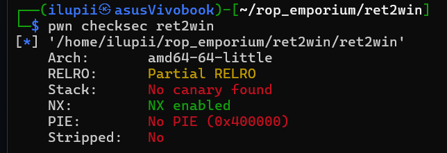

# ROP Emporium 
## Ret2win (x64)

inti dari soal ini yaitu mengubah alur binary yang tadi nya mengarah ke exit jadi mengarah ke win untuk ngeprint flag
ret2win

"A ret2win is simply a binary where there is a win() function (or equivalent); once you successfully redirect execution there, you complete the challenge."
https://ir0nstone.gitbook.io/notes/binexp/stack/ret2win

## Analisis
kita check binary nya 

